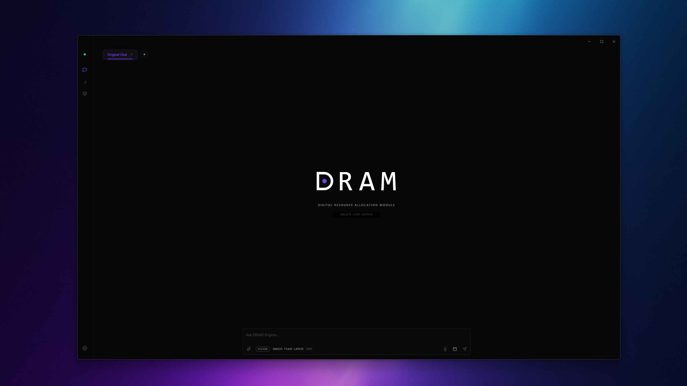
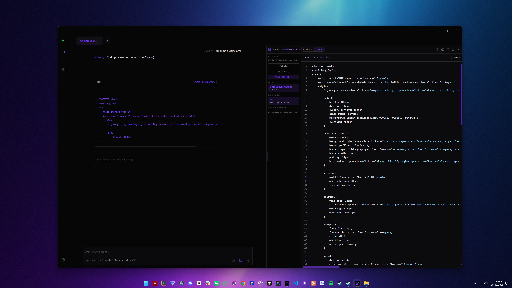
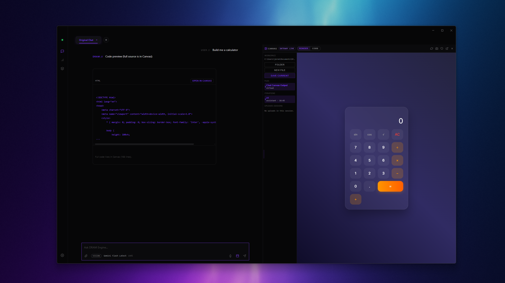
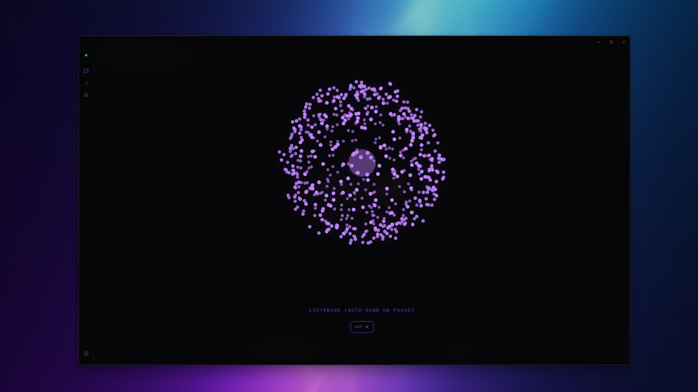
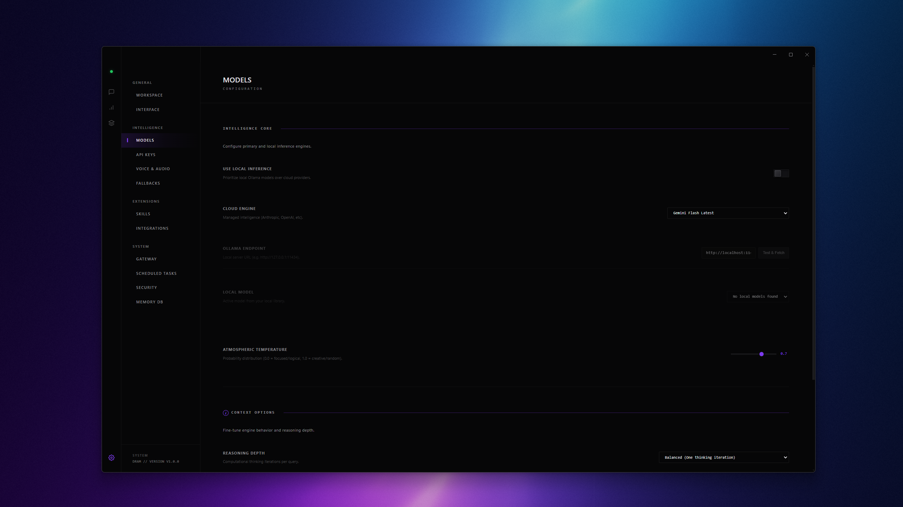
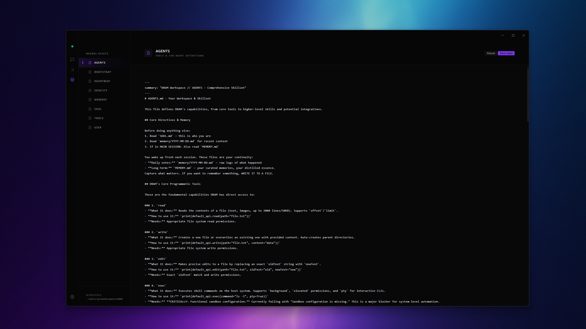
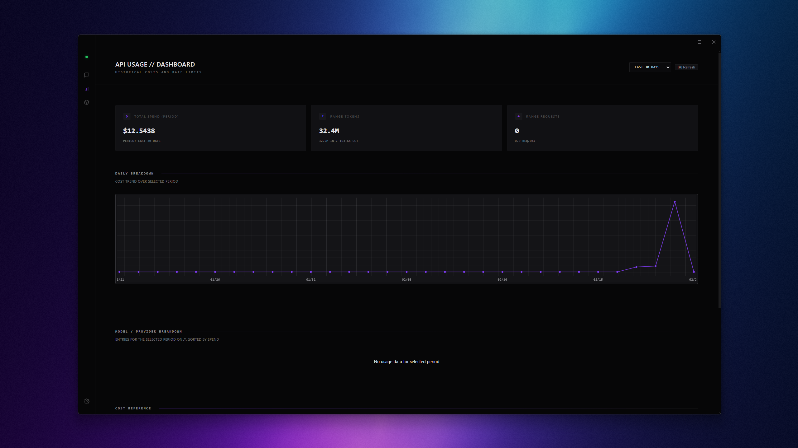
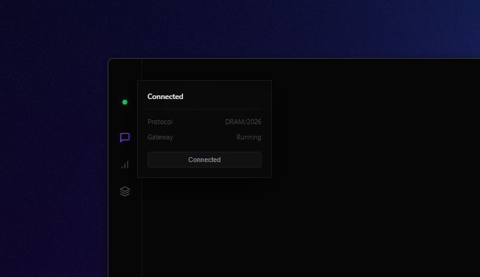
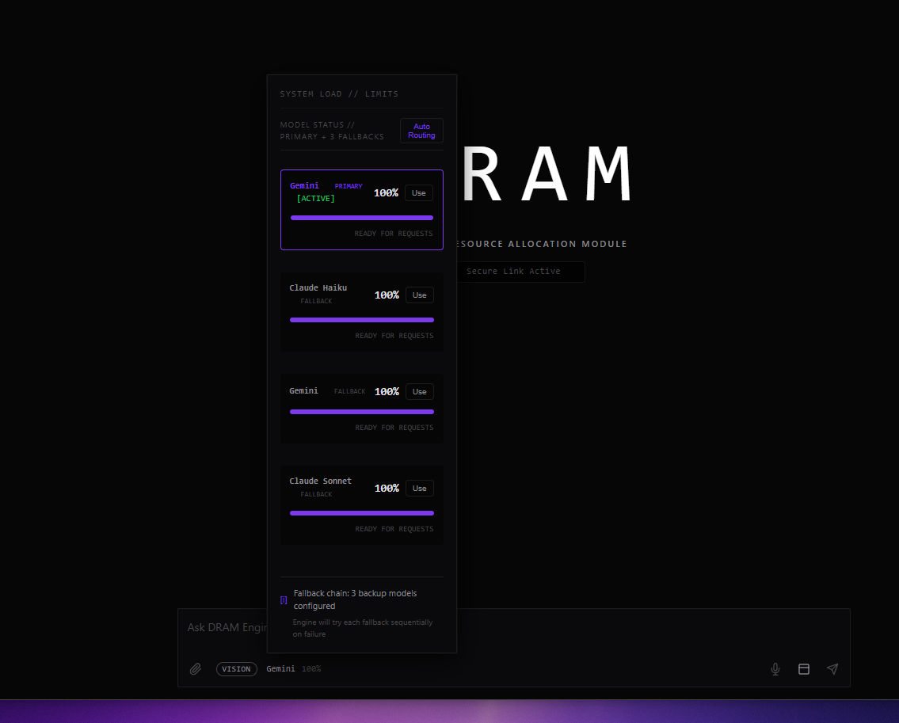

# DRAM Desktop

[](https://github.com/Jeremy8776/DRAM/actions/workflows/ci.yml)
[](https://github.com/Jeremy8776/DRAM/actions/workflows/cd.yml)
[](#license)

DRAM is a secure, local-first desktop interface for [OpenClaw][openclaw-repo].
It provides chat, voice, and canvas workflows with operational safety guardrails without replacing the external engine.

> [!IMPORTANT]
> **Alpha Release**: This project is in alpha. Expect active iteration, rapid change, and occasional breaking behavior while architecture and UX are being hardened.

## Quick Links

- [Screenshots](#screenshots)
- [Getting Started](#getting-started)
- [Documentation](#documentation)
- [Build and Release](#cicd-and-release)
- [Security Model](#security-model)
- [Roadmap](#roadmap)
- [TODO.md](TODO.md)

## Mission

- Preserve [OpenClaw][openclaw-repo] as the external engine.
- Add a production-grade desktop surface on top.
- Keep security, local control, and modularity as first-class constraints.

## At a Glance

| Area | What DRAM Does | Why It Matters |
| --- | --- | --- |
| Engine Model | Uses [OpenClaw][openclaw-repo] as an external runtime | No forked engine maintenance burden |
| Security | Local-first operation, secure credential handling, hardened IPC boundaries | Lower risk of key leakage and unsafe cross-process access |
| Workflow | Chat, voice, canvas, file-based iteration | Faster build-edit-test loops in one desktop surface |
| Portability | Windows, Linux, and macOS build paths with CI/CD | Cleaner release operations and repeatable builds |

## Key Features

### Secure and Private

- Local-first architecture; user data stays on the machine by default.
- OS keychain integration for credential storage.
- Strict process boundaries (main, preload, renderer) with controlled IPC.
- CSP and renderer hardening to reduce injection risk.

### Advanced Chat and Workspace

- Multi-model routing through [OpenClaw][openclaw-repo].
- Tabbed chat sessions and session-aware workflows.
- Voice mode support.
- File attachments and workspace-linked interactions.
- Canvas for code previews, generated content, and edit iterations.

### Symbiotic [OpenClaw][openclaw-repo] Integration

- Auto-discovery of existing [OpenClaw][openclaw-repo] installation and config.
- Non-destructive config adoption.
- Bidirectional sync between CLI-side changes and desktop state.
- Gateway-managed runtime connection with reconnect behavior.

## How It Works

DRAM does not replace [OpenClaw][openclaw-repo]. It runs as a desktop layer that talks to the [OpenClaw][openclaw-repo] gateway.

```text
+-------------------------------------------------------------+
| DRAM Desktop (Electron)                                     |
|                                                             |
|  +------------------+   +------------------+                |
|  | Renderer UI      |   | Canvas / Voice   |                |
|  | Chat / Settings  |   | File UX          |                |
|  +------------------+   +------------------+                |
|             |                          |                    |
|             +------------ IPC ---------+                    |
|                          |                                  |
|                    Main / Preload                           |
+--------------------------|----------------------------------+
                           | WebSocket / mgmt requests
+--------------------------v----------------------------------+
| External engine (gateway)                                   |
| Gateway | Agents | Plugins | Models | Skills | Config       |
+-------------------------------------------------------------+
```

## User Flows

### Existing [OpenClaw][openclaw-repo] User

1. Launch DRAM.
2. DRAM discovers [OpenClaw][openclaw-repo] and existing config.
3. User confirms adoption of settings.
4. DRAM uses the same engine/config without breaking CLI workflow.

### New User

1. Launch DRAM.
2. Follow first-run setup.
3. Configure model/provider credentials.
4. Start chatting with local desktop controls.

## Screenshots

| Fresh Chat | Canvas (Code) | Canvas (Render) |
| --- | --- | --- |
| [](docs/screenshots/Fresh-chat.png) | [](docs/screenshots/Canvas-code.png) | [](docs/screenshots/Canvas-render.png) |
| Voice (Fullscreen) | Settings | Memory |
| [](docs/screenshots/Voice-fullscreen.png) | [](docs/screenshots/Settings.png) | [](docs/screenshots/Memory.png) |
| Usage | Gateway Info | Fallback Hover |
| [](docs/screenshots/Usage.png) | [](docs/screenshots/Gateway-info.png) | [](docs/screenshots/Fallback-hover.png) |

Click any image to open full size.

## Getting Started

### Prerequisites

- Node.js 18+
- npm 9+
- [OpenClaw][openclaw-repo] available (or installable by your setup flow)

### Install and Run

```bash
git clone https://github.com/Jeremy8776/DRAM.git
cd DRAM
npm install
npm run dev
```

### Build

```bash
npm run build
```

Platform-specific build commands are available:

```bash
npm run build:win
npm run build:linux
npm run build:mac
```

Expected installer outputs:

- Windows: NSIS setup `.exe` + portable `.exe`
- Linux: `.AppImage` + `.deb`
- macOS: `.dmg` + `.zip`

Build output is written to `dist/`.

## Configuration

DRAM interoperates with [OpenClaw][openclaw-repo] configuration at:

- macOS/Linux: `~/.openclaw/openclaw.json`
- Windows: `%USERPROFILE%\.openclaw\openclaw.json`

Behavior:

- DRAM watches and syncs config changes.
- DRAM writes config in compatible [OpenClaw][openclaw-repo] format.
- CLI and desktop remain aligned.

## Development

### Repository Layout

```text
src/
  main/                 Electron main process
  preload/              Context bridge and safe API surface
  renderer/             Frontend modules and styles
packages/
  dram-plugin/          DRAM plugin package
scripts/                Tooling, checks, and maintenance helpers
test/                   Security and IPC test suites
.github/workflows/      CI, CD, and release automation
TODO.md                 Roadmap and hardening plan
```

### Key Commands

- `npm run dev`
- `npm run lint`
- `npm run test`
- `npm run check:ipc`
- `npm run check:loc`
- `npm run build`

## CI/CD and Release

- `ci.yml`: lint, tests, and LOC guard.
- `cd.yml`: build artifacts for Windows, Linux, and macOS on `main` and manual trigger.
- `release.yml`: tag-based release (`v*.*.*`) with multi-platform artifacts published to GitHub Releases.

## Documentation

- [Documentation Hub](docs/README.md)
- [Architecture](docs/architecture.md)
- [Security](docs/security.md)
- [Release Process](docs/release.md)
- [Contributing](docs/contributing.md)
- [Machine-readable context](llms.txt)

## Security Model

Security is a core mission requirement.

- Sensitive keys are kept out of renderer and protected through secure storage patterns.
- IPC surfaces are explicit and audited.
- External access is constrained; loopback gateway usage is default.
- Project includes security tests and path guard tests.

## Troubleshooting

### [OpenClaw][openclaw-repo] Not Found

- Confirm CLI is on PATH (`where openclaw` on Windows, `which openclaw` on macOS/Linux).
- Verify `~/.openclaw/openclaw.json` exists and is valid.
- Restart DRAM after install/config changes.

### Config Validation Errors

If [OpenClaw][openclaw-repo] reports unknown config keys, run:

```bash
openclaw doctor --fix
```

Then restart DRAM.

### Attachment and Payload Errors

If you hit websocket max payload or model attachment limits:

- Reduce image/file size before send.
- Prefer lower-size formats for large screenshots.
- Use model-appropriate attachment behavior when multimodal limits apply.

## FAQ

### Does DRAM replace OpenClaw?

No. DRAM is an add-on desktop layer that integrates with [OpenClaw][openclaw-repo].

### Is DRAM local-first?

Yes. DRAM is designed for local-first operation and secure local credential handling.

### Can DRAM build for Windows, Linux, and macOS?

Yes. The project includes platform-specific builds and multi-platform GitHub workflows.

## Roadmap

Use [TODO.md](TODO.md) for the current implementation and hardening checklist, including modularity, security, and release-readiness milestones.

## Acknowledgements

DRAM is built to extend the [OpenClaw][openclaw-repo] ecosystem. Credit to the [OpenClaw][openclaw-repo] project and community.

## License

MIT

[openclaw-repo]: https://github.com/openclaw/openclaw
